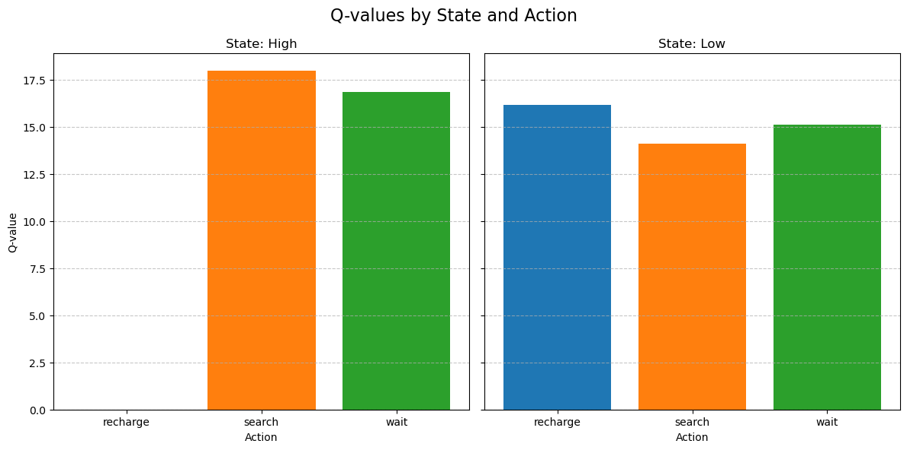

# Recycling Robot Project

## References

This example is inspired by the **"Reinforcement Learning: An Introduction, Second Edition"** by Richard S. Sutton and Andrew G. Barto. In particular, it is based on the Recycling Robot example presented in **Chapter 3: Finite Markov Decision Processes**.
Additionally, some of the concepts and implementation ideas were informed by resources available in the [mutual_information GitHub repository](https://github.com/Duane321/mutual_information/tree/main/videos/monte_carlo_for_RL_and_off_policy_methods).

    

## Introduction

The Recycling Robot project demonstrates how a mobile robot can learn to efficiently collect empty soda cans in an office environment using **reinforcement learning (RL)**. Equipped with sensors, a robotic arm, and a rechargeable battery, the robot must decide how to best spend its energy: searching for cans, waiting, or returning to recharge. By applying Q-learning—a fundamental RL algorithm—the robot ultimately learns a policy that maximizes long-term rewards: it gathers more cans while minimizing costly downtime due to battery depletion.

### Key Features

- **Two-State Energy Model**:  
  The robot’s battery level can be either:
  - **High (H)**: Sufficient charge to search for cans without risk of immediate depletion.
  - **Low (L)**: Nearly depleted, where searching is risky and may lead to a forced shutdown (and rescue).

- **Action Sets**:
  - From **High**: {**search**, **wait**}.
  - From **Low**: {**search**, **wait**, **recharge**}.

- **Transition Probabilities**:
  - From **High** energy, searching can: 
    - Lower the battery level with probability $1 - \alpha$.
    - Remain in High state with probability $\alpha$..
  - From **Low** energy, searching can:
    - Deplete the battery (requiring rescue) with probability $1 - \beta$.
    - Remain in Low state with probability $\beta$.
  
  Recharging from Low to High is deterministic.

### Parameters and Notation

- $r_{search}$: Expected reward from searching (e.g., number of cans found).
- $r_{wait}$: Expected reward while waiting (often smaller than $r_{search}$).

All these dynamics are captured in a finite Markov Decision Process (MDP), fully specified by:
- **States**: {High, Low}
- **Actions**: {Search, Wait, Recharge (Low only)}
- **Transition probabilities**: $p(s' | s, a)$
- **Rewards**: $r(s, a, s')$

| s    | a         | s'   | p(s' \| s, a) | r(s, a, s') |
|------|-----------|------|-------------|-------------|
| high | search    | high | `α`         | `r_search`  |
| high | search    | low  | `1 - α`     | `r_search`  |
| low  | search    | high | `1 - β`     | `-3`        |
| low  | search    | low  | `β`         | `r_search`  |
| high | wait      | high | `1`         | `r_wait`    |
| high | wait      | low  | `0`         | `-`         |
| low  | wait      | high | `0`         | `-`         |
| low  | wait      | low  | `1`         | `r_wait`    |
| low  | recharge  | high | `1`         | `0`         |
| low  | recharge  | low  | `0`         | `-`         |

## Implementation Details

We implement Q-learning to estimate the action-value function $Q(s,a)$ for each state-action pair. Over multiple episodes of interaction, the robot improves its policy, converging to near-optimal behavior.

### Q-Learning Update Rule

The Q-learning update for each step is:

$$
Q(s, a) \leftarrow Q(s, a) + \alpha \left[ r + \gamma \max_{a'} Q(s', a') - Q(s, a) \right]
$$

where:
- $\alpha$ is the learning rate (how fast we update our beliefs about the environment).
- $\gamma$ is the discount factor (how much future rewards matter).
- $r$ is the immediate reward received.
- $s'$ is the next state after taking action $a$ in state $s$.

### Epsilon-Greedy Policy

To balance exploration and exploitation:
- With probability $\epsilon$, the robot takes a random action.
- With probability $1 - \epsilon$, the robot chooses the action with the highest current Q-value.

## Results and Analysis

After training, the Q-table shows the learned values for each state-action pair. 
Results are as follows: See [robot_demo.ipynb](robot_demo.ipynb).

### Interpretation

#### **High State**:  
The Q-value for **Search** is the highest. This suggests that when the robot has ample energy, the most beneficial action is to search for cans, maximizing rewards at a manageable energy risk. **Wait** is slightly less beneficial but remains a reasonable action due to its low risk.

#### **Low State**:  
In a low-energy state, **Recharge** has the highest Q-value. This aligns with intuitive strategies: the robot prioritizes replenishing its energy to return to a high-energy state, enabling more profitable actions in subsequent steps.  
- **Wait** performs slightly better than **Search**, as searching in a low-energy state risks depleting the battery and incurring a penalty.  
- **Search**, while still viable, is less favorable because of the higher risk.

### Updated Policy Insights

The policy learned by the robot can be summarized as follows:
- In **High Energy States**:  
  - Proactively search for cans to maximize rewards.
- In **Low Energy States**:  
  - Prioritize recharging to ensure future viability and reduce the risk of penalties.

### Q-Values Visualization

The updated Q-value plot is shown below. It illustrates the robot's learned preferences for different actions across the states:

    

---

## How to Run

1. **Install Requirements**:
   Make sure you have Python 3 and `numpy`, `pandas`, `matplotlib`, and `tqdm` installed.
   
2. **Run the Training**:
   Execute the provided Python script and Jupyter notebook to train the Q-learning agent. Adjust parameters to see how they influence learning.

3. **View the Results**:
   After training, the script prints out the average reward and displays the Q-table. You can also visualize the Q-values to understand the learned policy.

---

By following these steps and reviewing the results, you can gain insight into how reinforcement learning techniques such as Q-learning enable agents—like our Recycling Robot—to autonomously develop strategies for balancing resource use and reward maximization.